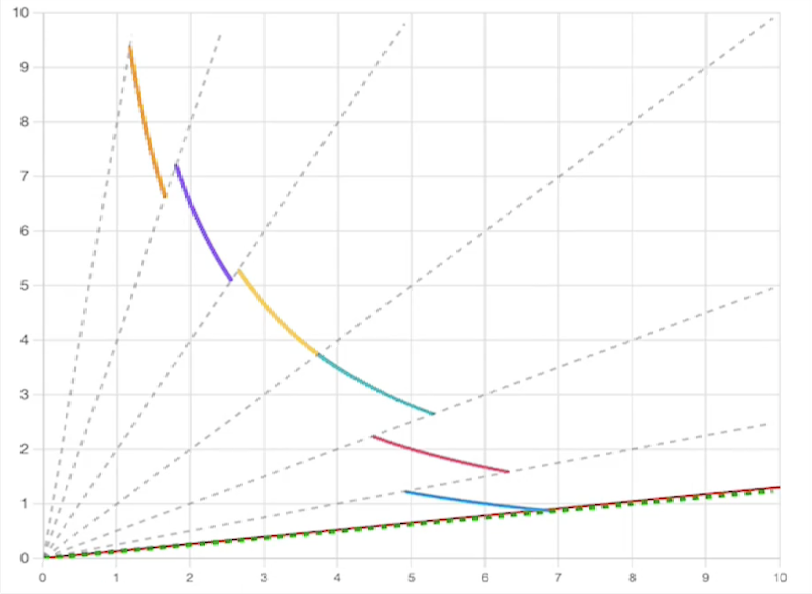
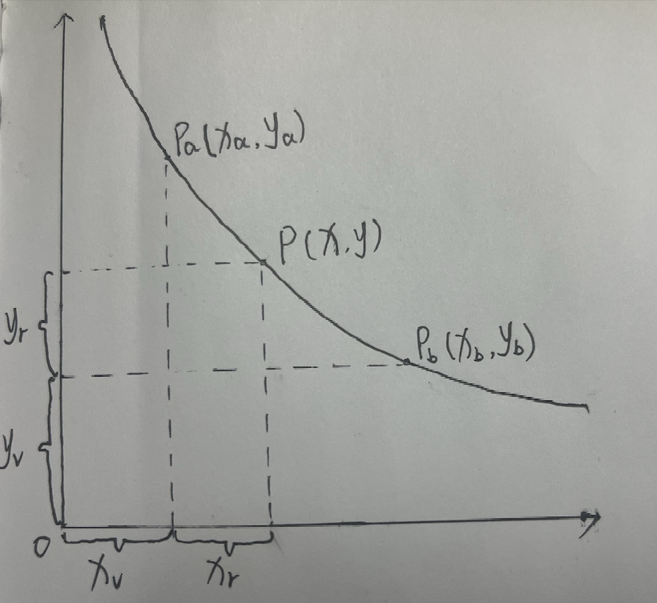

# Uniswap V3 OverView

## uniswap V2 的问题

在 uniswap V2 中，流动性按照 $x \cdot y = k$ 的价格曲线覆盖整个价格范围 $(0,\infty)$，也就是池子流动性允许以任何价格进行交易。

但在某一段时间内，资产价格可能主要在一个有限的范围内波动，例如假设 ETH 主要在 1300 到 1700 USDT 之间波动，稳定币通常围绕锚定价格交易。因此在所讨论期间，远离活跃价格区间的资金利用较少，下面我们用数学模型来更直观地看看这会导致什么问题？

假设 ETH/USDT 交易对的现货价格为 1500 USDT/ETH，流动性池子中共有资金 4500 USDT 和 3 ETH。以下忽略手续费、整数舍入和中途流动性变动。

用 x 表示 USDT，y 表示 ETH, $x_1$ = 4500, $y_1$ = 3, k = 13500

**如果价格下跌至 1300 USDT/ETH**, 此时则有：

$$
x_2 \cdot y_2 = 13500
$$

$$
\frac{x_2}{y_2} = 1300
$$

得: $x_2 \approx 4189.27$, $y_2 \approx 3.222517$，也就是说在 1500 到 1300 这个价格区间，只有 $4500 - x_2 \approx 310.73$ USDT 在支撑流动性

**如果价格上涨至 1700USDT/ETH**, 此时则有：

$$
x_3 \cdot y_3 = 13500
$$

$$
\frac{x_3}{y_3} = 1700
$$

得：$x_3 \approx 4790.62$, $y_3 \approx 2.818009$，也就是说在 1500 到 1700 这个价格区间，只有 $3 - y_3 \approx 0.181991$ ETH 在支撑流动性

从上面的例子中我们可以看出，假设 ETH 的价格在某一段时间内一直在 1300 - 1700 这个区间波动，而流动性被稀释到 $(0,\infty)$ 这个区间，资金利用率非常低，这会导致

- LP 的资金无法被充分利用，大部分流动性在支持这一时期交易较少的价格区间；实际收益还取决于成交量和竞争流动性等因素
- 在一个 trader 频繁交易的价格区间内，流动性无法被充分利用，增大大额交易的 price impact。

而这个缺点在 USDT/DAI 这类稳定币交易对中会被放大，因为在两者都保持锚定时，通常围绕 1:1 交易，价格区间很小，资金利用率会进一步降低。为了解决这个问题，uniswap V3 引入了集中流动性。

## 集中流动性

在 uniswap V3 中，一个交易对的整个价格曲线被拆分成多个价格区间，LP 可以选择他们想要提供流动性的价格区间，每个区间都有各自的流动性，这将允许 LP 把更多的流动性投入到活跃的价格区间内，提高资金利用率。价格离开所选区间后，头寸不再参与交易，暂不赚取交易手续费；价格重新进入区间时恢复。

### 数学模型

为了理解这种区间化流动性的运作方式，我们可以引入一个数学上的概念———**虚拟储备**。它是用于描述区间内交易的等效储备，与 LP 实际存入的资产不同。本节用 $(x,y)$ 表示完整的虚拟储备，取 $P=y/x$，与上面的 $x/y$ 报价约定不同；图中 $P_a$ 为价格上界，$P_b$ 为下界。下图展示了某一价格区间内的流动性曲线：

其中点 $P(x, y)$ 表示当前市场价格，点 $P_a(x_a, y_a)$ 与 $P_b(x_b, y_b)$ 是 LP 选择的价格区间边界。

LP 的真实储备为 $(x_r,y_r)$，仅用于支持价格区间 $[P_b,P_a]$ 内的交易。将固定偏移量 $(x_v,y_v)$ 加到真实储备上，便得到完整的虚拟储备 $(x,y)$，满足恒定乘积关系：

$$
x \cdot y = k
$$

$$
(x_v + x_r)(y_v + y_r) = k
$$

那么我们该怎么计算这些偏移量呢？用 $L=\sqrt{k}$ 表示流动性，由 $P=y/x$ 可得：

$$
y = L \cdot \sqrt{P}\\
x = \frac{L}{\sqrt{P}}
$$

在上下界分别有 $x_r=0$ 和 $y_r=0$，因此 $x_v=L/\sqrt{P_a}$、$y_v=L\sqrt{P_b}$。代入得：

$$
(x_r + \frac{L}{\sqrt{P_a}})(y_r + L \cdot \sqrt{P_b}) = L^2
$$

该公式进一步揭示了 Uniswap V3 的核心机制：在任意价格区间 $[P_b,P_a]$ 定义独立的流动性 $L$ ，UniswapV3 便能够在区间内构建独立的恒定乘积做市模型。这种“分段式恒定乘积”的结构不仅保留了恒定乘积做市原理，也实现了更高的资金利用率与策略灵活性。

## UniswapV3 的架构

UniswapV3 同样采用了`core-periphery`的分层设计，但相较于 V2，逻辑更复杂。

### core

- **UniswapV3Factory**
  1. 负责创建并注册所有`UniswapV3Pool`，是池子的创建与注册入口。
  2. 管理可用费率档位（初始为 0.05%、0.3%、1%）和对应的 `tickSpacing`；其 owner 还可通过 Pool 设置和提取协议费。
- **UniswapV3Pool**
  采用了集中流动性设计，实现了核心的 AMM 定价逻辑，Swap 执行，LP 头寸管理，实现了 TWAP 等高级功能

### periphery

- **NonfungiblePositionManager**
  在`UniswapV3Pool`合约的基础上，将 LP 头寸用 NFT 表示，并提供了更加友好的 LP 操作入口

- **SwapRouter**
  在`UniswapV3Pool`合约的基础上，封装了复杂的逻辑，确保用户只需要输入路径，数量等简单的参数即可完成交易，支持多跳路径，并封装了回调机制。
