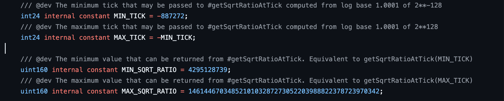
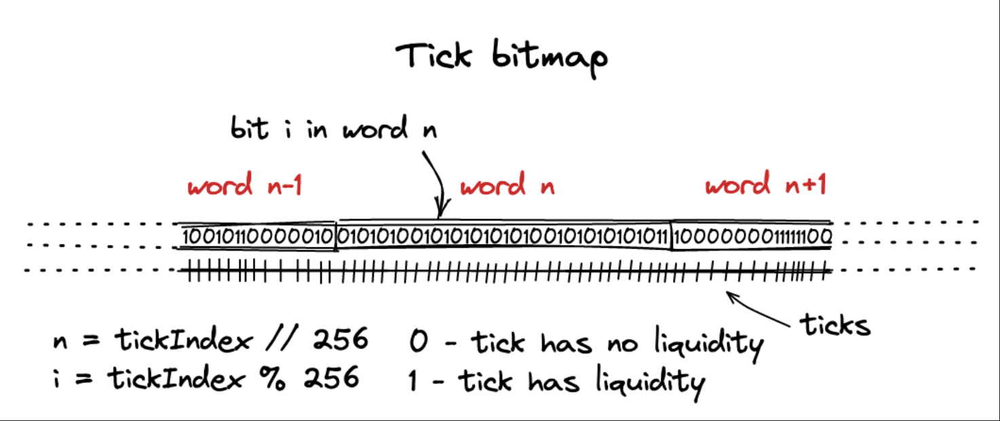
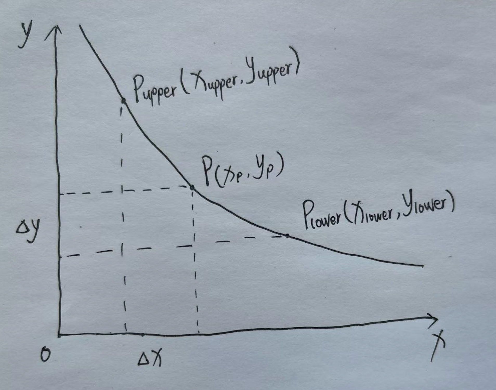

# Uniswap V3 tick

> UniswapV3 引入了集中流动性的概念，LP 可以在某一价格区间内添加流动性。这引出了一个关键问题：**这个价格区间可以随意设置吗？**如果价格区间是可以随意设置的话，会带来什么问题？我们假设现在有 10 万个地址添加了流动性，并且每个地址的价格区间都不一样，逐个遍历这些头寸来计算当前活跃流动性，就会非常消耗 gas。为了解决这个问题，uniswapV3 引入了**tick**的概念。tick 的设计不仅优化了 gas 成本，还为集中流动性提供了价格刻度，使得流动性分布更加高效和可控。

## tick

tick 是一个离散化价格空间的单位，它将连续的价格空间划分为一系列固定的价格点，LP 使用这些点作为流动性区间的边界。通俗点说，tick 就像是价格的刻度线，把整个价格空间切分成一格一格的，你不能在任意价格点添加流动性，只能在这些刻度之间设定范围。具体可用的区间边界还要满足池子的 tickSpacing，即 tick 必须是 tickSpacing 的整数倍。这样所有人都在统一的价格刻度上操作，区间统计只需维护用作端点的 tick，仍需单独保存各 owner 的 position。

### tick 是怎么跟价格挂钩的？

tick 本质上是价格的对数索引，uniswapV3 使用 tick 来标记价格区间，每个 tick 都对应一个价格：

$$
P(i)= 1.0001^i
$$

$P(i)$即为 tick $i$的价格，即 tick 是价格在以 1.0001 为底的对数刻度上的整数索引。每增加一个 tick，对应的价格就乘以 1.0001。池子同时用 sqrtPriceX96 保存更精细的平方根价格，实际价格可以位于两个相邻 tick 对应的价格之间。

下文 token0、token1 按代币地址从小到大排列，$P$ 统一表示以代币最小单位计量的 token1/token0 报价。若两种代币的精度分别为 $decimals_0$、$decimals_1$，则每个完整 token0 对应的 token1 数量为：

$$
P_{\text{human}} = \left(\frac{\text{sqrtPriceX96}}{2^{96}}\right)^2 \cdot 10^{decimals_0-decimals_1}
$$

下图用平方根价格 $\sqrt{P(i)}=1.0001^{i/2}$ 的近似值展示 tick 刻度：



### 为什么要这么做？

1. 价格刻度均匀

   使用 1.0001 的幂次方有一个很好的性质就是：相邻 tick 对应的价格，从低到高增加 0.01%，也就是一个基点，这是金融市场中用来衡量百分比的一个单位。金融市场更看重“价格的百分比变化”，比如价格从 100 到 200 涨了 100%，从 200 到 400 也涨了 100%，虽然差值不同，但重要的是百分比，也就是涨跌幅。使用 tick 可以让价格在对数刻度下分布均匀。

2. 节省 gas，安全

   tick 用整数索引管理区间，sqrtPriceX96 用定点数保存平方根价格，两者都可以通过整数运算处理，便于链上计算和 Bitmap 索引。

## 源码解读

在理解了 tick 的概念后，开始深入其源码实现，通过学习源码，理解 tick 在池中如何被管理，如何响应价格变化，以及设计背后的技术考虑，为后面的流动性计算和 swap 逻辑奠定基础。这里主要学习三个关于 tick 的核心模块的源码：

- **TickMath**：是一个纯数学库，负责 tick 到 price 的映射，确保价格计算的准确和高效安全
- **Tick**：管理每个 tick 的状态，包括初始化与清理，tick 上的流动性变化，手续费累计，跨越 tick 处理等逻辑
- **TickBitmap**：提供高效的存储方式，记录或修改 tick 的初始化状态，并支持快速查询

### TickMath

#### 常量



在了解图中定义的常量前，我们需要了解一点，uniswapV3 中实际上并不会使用到价格，而是 $\sqrt{P}$ 。因为在流动性计算和 swap 的数学计算中，使用到更多的是 $\sqrt{P}$ ，并且平方根计算并不精确，会引入取整的问题，所以干脆就在合约中存平方根的结果，而不是计算它。

在 uniswapV3 中存储 $\sqrt{P}$ 时使用的是`uint160`的类型，Q64.96 类型的定点数（即高 64 位作为整数部分，低 96 位作为小数部分），其编码是将 $\sqrt{P}$ 放大 $2^{96}$ 倍后保存的整数。排除 0 后，编码整数的范围为 $[1,2^{160}-1]$，对应可表示的 $\sqrt{P}$ 范围为 $[2^{-96},2^{64}-2^{-96}]$。

由于 $P(i)= 1.0001^i$ ， $\sqrt{P}$ 与 tick 的关系为：

$$
\sqrt{P(i)}=1.0001^{\frac{i}{2}}
$$

但 TickMath 并没有用满这个可表示范围。[源码](https://github.com/Uniswap/v3-core/blob/d0831dc6b8a318df3872b6d68f6de135c9f3ec29/contracts/libraries/TickMath.sol)用于确定 tick 边界的理论价格范围为 $[2^{-128},2^{128}]$，对应 $\sqrt{P}$ 的范围为 $[2^{-64},2^{64}]$。以这个范围为约束，反推合法的整数 tick：

- tick 的最大值

  需要满足 $\sqrt{P(i)} \leq 2^{64}$

  代入上面公式，不等式为： $1.0001^{\frac{i}{2}} \leq 2^{64}$

  两边取自然对数并化简后可得： $i \leq \frac{128\ln 2}{\ln 1.0001} \approx 887272.75$。由于 tick 必须是整数，上界向下取整，得到`MAX_TICK = 887272`。

- tick 的最小值

  需要满足 $\sqrt{P(i)} \geq 2^{-64}$

  同理，不等式为： $1.0001^{\frac{i}{2}} \geq 2^{-64}$

  两边取自然对数并化简后可得： $i \geq \frac{-128\ln 2}{\ln 1.0001} \approx -887272.75$。下界向上取整，得到`MIN_TICK = -887272`。

根据 tick 的整数边界，再计算对应的 Q64.96 编码端点。具体整数值由`getSqrtRatioAtTick`中的定点近似计算和最后一步向上取整确定：

- TickMath 的最大编码端点

  代入 tick 的最大值，理论编码为 $1.0001^{443636}\cdot2^{96}$。源码通过`getSqrtRatioAtTick(887272)`得到`MAX_SQRT_RATIO = 1461446703485210103287273052203988822378723970342`。

- TickMath 的最小编码端点

  代入 tick 的最小值，理论编码为 $1.0001^{-443636}\cdot2^{96}$。源码通过`getSqrtRatioAtTick(-887272)`得到`MIN_SQRT_RATIO = 4295128739`。

上述推导的顺序是：先明确协议采用的价格范围，再求出合法的整数 tick，最后计算这两个 tick 对应的编码端点。`MIN_TICK`、`MAX_TICK`限制 tick 的取值，`MIN_SQRT_RATIO`、`MAX_SQRT_RATIO`则是`getSqrtRatioAtTick`在这两个边界上的返回值。

> 💡 **PS：**
> 我在学习这个推导过程中的时候，有个疑问：能不能用 $\sqrt{P}$ 的范围反推 tick 的范围？这其实就是上面的推导过程，两者通过 $1.0001^{i/2}$ 单调对应，可以互相推算；tick 必须是整数，只意味着求得边界后需要向内取整。
>
> 这里需要区分**存储格式能表示的范围**和**协议实际采用的范围**。如果只要求编码大于 0，也就是 $\sqrt{P}\geq2^{-96}$，推出来的 tick 下界约为 -1330909，无法得到 -887272；后者还依赖 TickMath 采用的价格范围约束。

#### getSqrtRatioAtTick

这个函数用于将一个 tick 转换为 $\sqrt{P}$ 的 Q64.96 定点数（之后用 sqrtPriceX96 表示），在数学层面上，给定一个 tick $i$:

$$
\text{sqrtPriceX96} = 1.0001 ^{\frac{i}{2}} \cdot 2^{96}
$$

EVM 有整数幂指令 EXP，但不能直接处理这里的定点底数、分数指数和精度控制，也没有原生浮点数和开方指令。逐次累乘需要 $O(|i|)$ 次乘法，链上执行成本较高。Uniswap V3 使用 **快速幂 + 预计算常量**：展开 $|i|$ 的二进制位，第 k 位为 1 时，乘以 $1.0001^{-2^k/2}$ 对应的定点常量，只需 $O(\log|i|)$ 次乘法。先按负的绝对 tick 累乘，正 tick 再取倒数。

_快速幂思想_

假设要计算 $a^n$ ,指数的二进制表示： $n = b_k b_{k-1} \dots b_1 b_0$ ，每一位 $b_i = 0$ 或 1，则：

$$
a^n = a^{b_0 \cdot 2^0} \cdot a^{b_1 \cdot 2^1} \cdot \dots \cdot a^{b_k \cdot 2^k}
$$

举例：计算 $a^{13}$

- 13 的二进制是 `1101`

拆解每一位：

- bit0 = 1 → 乘 $a^{1 \cdot {2^0}} = a^1$
- bit1 = 0 → 乘 $a^{0 \cdot {2^1}} = a^0$
- bit2 = 1 → 乘 $a^{1 \cdot {2^2}} = a^4$
- bit3 = 1 → 乘 $a^{1 \cdot {2^3}} = a^8$

最终乘积： $a^1 \cdot a^4 \cdot a^8 = a^{13}$ 。如果这些幂值已经备好，从 1 开始只需要 3 次累乘（对应 bit = 1）。

_预计算常量_

普通快速幂通过重复平方，已经能将乘法次数降到 $O(\log|i|)$。uniswapV3 的底数固定，可以预计算这些幂值，省去运行时构造它们的工作。源码先计算 $1.0001^{-|i|/2}$，若 $|i|$ 的二进制位为 $b_0,b_1,\dots,b_k$，拆解后可得：

$$
1.0001^{-|i|/2} = \sqrt{1.0001^{-2^0 \cdot b_0}} \cdot \sqrt{1.0001^{-2^1 \cdot b_1}} \cdot \dots \cdot \sqrt{1.0001^{-2^k \cdot b_k}}
$$

每一位需要的常量为 $C_k\approx1.0001^{-2^k/2}\cdot2^{128}$。根据该位是 0 或 1，选择跳过或乘上对应常量，这就是预计算常量的思想。$|tick|$ 最大为 887272，二进制最多 20 位。累乘后，正 tick 取倒数，再将结果转换为 Q64.96，得到 sqrtPriceX96。

_代码解读_

```solidity
function getSqrtRatioAtTick(int24 tick) internal pure returns (uint160 sqrtPriceX96) {
    // Step 1: 取 tick 的绝对值，后续先按负指数累乘
    uint256 absTick = tick < 0 ? uint256(-int256(tick)) : uint256(int256(tick));
    require(absTick <= uint256(MAX_TICK), 'T'); // 检查tick边界

    // Step 2: 初始化 ratio
    // absTick 的第 0 位：如果为 1，使用 sqrt(1.0001^(-2^0)) 的 Q128.128 近似值
    //                  如果为 0，使用 1 的 Q128.128 编码
    uint256 ratio = absTick & 0x1 != 0
        ? 0xfffcb933bd6fad37aa2d162d1a594001   // C_0 ≈ sqrt(1.0001^(-2^0)) * 2^128
        : 0x100000000000000000000000000000000; // 1

    // Step 3: 从第 1 位tick的二进制开始，遍历每一位二进制，按预先计算好的常量进行快速幂累乘
    // 这里要注意，ratio是Q128.128的定点数，所有计算好的常量C_0,C_1,C_2 … C_19,包括上面的1，也都是Q128.128的定点数，
    // 所以每次累乘后都需要做右移128，把结果缩放回原始定点数的精度
    if (absTick & 0x2 != 0) ratio = (ratio * 0xfff97272373d413259a46990580e213a) >> 128; // C_1
    if (absTick & 0x4 != 0) ratio = (ratio * 0xfff2e50f5f656932ef12357cf3c7fdcc) >> 128; // C_2
    if (absTick & 0x8 != 0) ratio = (ratio * 0xffe5caca7e10e4e61c3624eaa0941cd0) >> 128; // C_3
    if (absTick & 0x10 != 0) ratio = (ratio * 0xffcb9843d60f6159c9db58835c926644) >> 128; // C_4
    if (absTick & 0x20 != 0) ratio = (ratio * 0xff973b41fa98c081472e6896dfb254c0) >> 128; // C_5
    if (absTick & 0x40 != 0) ratio = (ratio * 0xff2ea16466c96a3843ec78b326b52861) >> 128; // C_6
    if (absTick & 0x80 != 0) ratio = (ratio * 0xfe5dee046a99a2a811c461f1969c3053) >> 128; // C_7
    if (absTick & 0x100 != 0) ratio = (ratio * 0xfcbe86c7900a88aedcffc83b479aa3a4) >> 128; // C_8
    if (absTick & 0x200 != 0) ratio = (ratio * 0xf987a7253ac413176f2b074cf7815e54) >> 128; // C_9
    if (absTick & 0x400 != 0) ratio = (ratio * 0xf3392b0822b70005940c7a398e4b70f3) >> 128; // C_10
    if (absTick & 0x800 != 0) ratio = (ratio * 0xe7159475a2c29b7443b29c7fa6e889d9) >> 128; // C_11
    if (absTick & 0x1000 != 0) ratio = (ratio * 0xd097f3bdfd2022b8845ad8f792aa5825) >> 128; // C_12
    if (absTick & 0x2000 != 0) ratio = (ratio * 0xa9f746462d870fdf8a65dc1f90e061e5) >> 128; // C_13
    if (absTick & 0x4000 != 0) ratio = (ratio * 0x70d869a156d2a1b890bb3df62baf32f7) >> 128; // C_14
    if (absTick & 0x8000 != 0) ratio = (ratio * 0x31be135f97d08fd981231505542fcfa6) >> 128; // C_15
    if (absTick & 0x10000 != 0) ratio = (ratio * 0x9aa508b5b7a84e1c677de54f3e99bc9) >> 128; // C_16
    if (absTick & 0x20000 != 0) ratio = (ratio * 0x5d6af8dedb81196699c329225ee604) >> 128; // C_17
    if (absTick & 0x40000 != 0) ratio = (ratio * 0x2216e584f5fa1ea926041bedfe98) >> 128; // C_18
    if (absTick & 0x80000 != 0) ratio = (ratio * 0x48a170391f7dc42444e8fa2) >> 128; // C_19

    // Step 4: tick 为正数时，取倒数得到正指数对应的比例
    if (tick > 0) ratio = type(uint256).max / ratio;

    // Step 5: 转换 Q128.128 -> Q64.96 并向上取整
    sqrtPriceX96 = uint160((ratio >> 32) + (ratio % (1 << 32) == 0 ? 0 : 1));
}
```

#### getTickAtSqrtRatio

这个函数用于将一个 sqrtPriceX96 转换为对应的整数 tick。先忽略定点舍入，在数学层面上，给定一个 sqrtPriceX96，其对应的连续索引 $i$ 为：

$$
i = 2 \cdot \log_{1.0001}\left(\frac{\text{sqrtPriceX96}}{2^{96}}\right)
$$

但这个连续索引不一定是整数。函数实际返回的是满足`getSqrtRatioAtTick(tick) <= sqrtPriceX96`的最大整数 tick，输入范围为`[MIN_SQRT_RATIO, MAX_SQRT_RATIO)`。

这个公式中计算的难点是 $log_{1.0001}$ ，因为 EVM 没有原生对数运算，也不支持浮点数。UniswapV3 通过换底公式把它转换成 $log_2$，用 MSB 确定整数部分，再通过反复平方和移位提取小数部分，最后校验候选 tick。

_换底公式转换_

在数学中，对数运算中的换底公式如下：

$$
log_a b = \frac{\log_c b}{\log_c a}
$$

将 $log_{1.0001}$ 转换成 $log_2$ ，则有：

$$
log_{1.0001} \left(\frac{\text{sqrtPriceX96}}{2^{96}}\right) = \frac{\log_2 \left(\frac{\text{sqrtPriceX96}}{2^{96}}\right)}{\log_2 1.0001}
$$

拆开分数部分：

$$
log_2 \left(\frac{\text{sqrtPriceX96}}{2^{96}}\right) = \log_2 (\text{sqrtPriceX96}) - \log_2 (2^{96}) = \log_2 (\text{sqrtPriceX96}) - 96
$$

最终得到连续索引的公式：

$$
i = \frac{2 \cdot \left( \log_2 (\text{sqrtPriceX96}) - 96 \right)}{\log_2 1.0001}
$$

观察这个公式， $log_2 1.0001$ 是一个定值，可以预计算。重点在如何处理 $log_2 (\text{sqrtPriceX96})$。

_处理 log2 运算_

- 任何正数都可以拆成“2 的整数次幂 乘以 一个 $[1,2)$ 之间的数”
  - 5 可以写成 4 x 1.25，其中 4 是 $2^2$(2 的整数次幂)，1.25 是介于[1,2)之间的数，即 $5 = 2^2 \cdot 1.25$
  - 0.3 可以写成 0.25 x 1.2，其中 0.25 是 $2^{-2}$(2 的负整数次幂)，1.2 是介于[1,2)之间的数，即 $0.3 = 2^{-2} \cdot 1.2$
- $log_2(x) = \text{整数部分} + \text{小数部分}$

  根据对数的运算法则： $log_2(a \cdot b) = \log_2(a) + \log_2(b)$
  由于上面提到任何正数都可以拆成“2 的整数次幂 乘以 一个 $[1,2)$ 之间的数的性质，如果 $x$ 拆成 $2^n \cdot m$ 后，自然变成：

$$
log_2(x) = \log_2(2^n) + \log_2(m) = n + \log_2(m)
$$

这里 $n=\lfloor\log_2(x)\rfloor$，即向下取整后的整数部分，剩余的 $\log_2(m)$ 位于 [0,1)（因为 m 在 [1,2)之间， $\log_2(1)=0$， $\log_2(2)=1$）。即使对数为负，也按这种方式拆分。

- 找到 n 和 m

  1.  找 n（整数部分）

      对于链上存储的正整数 x，二进制中的最高有效位（MSB），也就是最左边那个 “1” 的位置（从最低位的 0 开始计数），等于 $\lfloor\log_2(x)\rfloor$：

      - 5 的二进制表示 “101”，MSB 为 2， $log_2(5)$ 的整数部分也是 2
      - 8 的二进制表示 “1000”，MSB 为 3， $log_2(8)$ 的整数部分也是 3

  2.  求 $log_2(m)$

      找到 n 后，把 x 除以 $2^n$，得到 m。接下来利用平方运算，逐位求出 $\log_2(m)$ 的二进制小数。

      这里利用了对数的性质：

      $$
      \log_2(m^2)=2\log_2(m)
      $$

      把对数乘以 2，相当于将它的二进制小数左移一位，原来的第一位小数就变成了整数部分。由于 $m^2\in[1,4)$，这一位只可能是 0 或 1：

      - 如果 $m^2<2$，说明 $\log_2(m^2)<1$，这一位为 0，下一轮使用 $m^2$。
      - 如果 $m^2\geq2$，说明 $\log_2(m^2)\geq1$，这一位为 1，下一轮使用 $m^2/2$，去掉已经取出的整数部分。

      更新后的 m 仍在 [1,2) 内，可以重复同样的操作，继续提取下一位。第 k 轮取出的位，对应原来对数中 $2^{-k}$ 的权重。

      - 举例：$m=1.5$

        1. 平方得到 2.25，取出 1，再除以 2，得到下一轮的 m=1.125。
        2. 平方得到 1.265625，取出 0，直接作为下一轮的 m。
        3. 平方得到 1.601806640625，取出 0，继续迭代。

      前三位是二进制小数 $0.100_2$，对应近似值 0.5。继续取位会逐步接近 $\log_2(1.5)\approx0.5849625$。源码提取了 14 位二进制小数，随后通过换底和误差界计算候选 tick，再用正向函数校验，得到最终的整数 tick。

_源码解读_

源码先把输入左移 32 位，得到以 $2^{128}$ 缩放的`ratio`，所以平方根价格对数的整数部分是`msb - 128`。归一化后，`r / 2^127`表示上面使用的 m；右移时可能有整数截断。每轮的`r*r >> 127`完成定点平方，`r >> 128`判断平方结果是否达到 2，`r >>= f`则在需要时除以 2。

```solidity
function getTickAtSqrtRatio(uint160 sqrtPriceX96) internal pure returns (int24 tick) {
    // Step 1: 输入边界检查
    require(sqrtPriceX96 >= MIN_SQRT_RATIO && sqrtPriceX96 < MAX_SQRT_RATIO, 'R');

    // Step 2: 把 Q64.96 -> Q128.128 形式（左移 32）
    // 将相同的平方根价格改用 2^128 缩放，便于后续统一计算
    uint256 ratio = uint256(sqrtPriceX96) << 32;

    // Step 3: 用 r 和 msb 寻找最高有效位（MSB），确定 log2(ratio) 的整数部分
    uint256 r = ratio;
    uint256 msb = 0;

    // 下面一系列 assembly 使用二分法累加256位的ratio的最高有效位（128，64，32...2,1）
    assembly {
        let f := shl(7, gt(r, 0xFFFFFFFFFFFFFFFFFFFFFFFFFFFFFFFF))
        msb := or(msb, f)
        r := shr(f, r)
    }
    assembly {
        let f := shl(6, gt(r, 0xFFFFFFFFFFFFFFFF))
        msb := or(msb, f)
        r := shr(f, r)
    }
    assembly {
        let f := shl(5, gt(r, 0xFFFFFFFF))
        msb := or(msb, f)
        r := shr(f, r)
    }
    assembly {
        let f := shl(4, gt(r, 0xFFFF))
        msb := or(msb, f)
        r := shr(f, r)
    }
    assembly {
        let f := shl(3, gt(r, 0xFF))
        msb := or(msb, f)
        r := shr(f, r)
    }
    assembly {
        let f := shl(2, gt(r, 0xF))
        msb := or(msb, f)
        r := shr(f, r)
    }
    assembly {
        let f := shl(1, gt(r, 0x3))
        msb := or(msb, f)
        r := shr(f, r)
    }
    assembly {
        let f := gt(r, 0x1)
        msb := or(msb, f)
    }

    // Step 4: 使用 msb 将 ratio 归一化到 [2^127, 2^128) 区间，便于后续小数部分逼近
    if (msb >= 128) r = ratio >> (msb - 127);
    else r = ratio << (127 - msb);

    // Step 5: 用 64 位小数存储 log2(sqrtPriceX96 / 2^96)，先写入整数部分
    // ratio 已放大 2^128，因此解码后的整数部分是 msb - 128
    int256 log_2 = (int256(msb) - 128) << 64;

    // Step 6: 通过 14 次平方和判定，依次提取小数位，写入 log_2 的第 63 到第 50 位
    // r = r*r >> 127; f = r >> 128; 将 f 写入对应位；除最后一轮外，再执行 r >>= f 归一化
    assembly {
        r := shr(127, mul(r, r))
        let f := shr(128, r)
        log_2 := or(log_2, shl(63, f))
        r := shr(f, r)
    }
    assembly {
        r := shr(127, mul(r, r))
        let f := shr(128, r)
        log_2 := or(log_2, shl(62, f))
        r := shr(f, r)
    }
    assembly {
        r := shr(127, mul(r, r))
        let f := shr(128, r)
        log_2 := or(log_2, shl(61, f))
        r := shr(f, r)
    }
    assembly {
        r := shr(127, mul(r, r))
        let f := shr(128, r)
        log_2 := or(log_2, shl(60, f))
        r := shr(f, r)
    }
    assembly {
        r := shr(127, mul(r, r))
        let f := shr(128, r)
        log_2 := or(log_2, shl(59, f))
        r := shr(f, r)
    }
    assembly {
        r := shr(127, mul(r, r))
        let f := shr(128, r)
        log_2 := or(log_2, shl(58, f))
        r := shr(f, r)
    }
    assembly {
        r := shr(127, mul(r, r))
        let f := shr(128, r)
        log_2 := or(log_2, shl(57, f))
        r := shr(f, r)
    }
    assembly {
        r := shr(127, mul(r, r))
        let f := shr(128, r)
        log_2 := or(log_2, shl(56, f))
        r := shr(f, r)
    }
    assembly {
        r := shr(127, mul(r, r))
        let f := shr(128, r)
        log_2 := or(log_2, shl(55, f))
        r := shr(f, r)
    }
    assembly {
        r := shr(127, mul(r, r))
        let f := shr(128, r)
        log_2 := or(log_2, shl(54, f))
        r := shr(f, r)
    }
    assembly {
        r := shr(127, mul(r, r))
        let f := shr(128, r)
        log_2 := or(log_2, shl(53, f))
        r := shr(f, r)
    }
    assembly {
        r := shr(127, mul(r, r))
        let f := shr(128, r)
        log_2 := or(log_2, shl(52, f))
        r := shr(f, r)
    }
    assembly {
        r := shr(127, mul(r, r))
        let f := shr(128, r)
        log_2 := or(log_2, shl(51, f))
        r := shr(f, r)
    }
    assembly {
        r := shr(127, mul(r, r))
        let f := shr(128, r)
        log_2 := or(log_2, shl(50, f))
    }

    // Step 7: 换底并把表示扩到 Q128.128
    // 常数约为 2^64 / log2(sqrt(1.0001))；log_2 已缩放 2^64，相乘后得到缩放 2^128 的近似 tick
    int256 log_sqrt10001 = log_2 * 255738958999603826347141; // Q128.128 表示

    // Step 8: 根据定点 log 值估算两个候选 tick（low / hi）作为边界
    // 这两个常数是偏移量以保证误差边界（源码用的常量）
    int24 tickLow = int24((log_sqrt10001 - 3402992956809132418596140100660247210) >> 128);
    int24 tickHi  = int24((log_sqrt10001 + 291339464771989622907027621153398088495) >> 128);

    // Step 9: 候选相同则直接返回；否则检查 tickHi 对应的编码是否不超过输入，选择 tickHi 或 tickLow
    // （保证返回最大满足 getSqrtRatioAtTick(tick) <= sqrtPriceX96 的 tick）
    tick = tickLow == tickHi ? tickLow : (getSqrtRatioAtTick(tickHi) <= sqrtPriceX96 ? tickHi : tickLow);
}

```

### TickBitMap

在 uniswapV3 中，流动性是分布在不同的价格区间，执行 swap 时，价格必须从当前 tick 出发，逐区间迭代，累积流动性，直到满足交易数量，中间还需要跳过无流动性的区域。这就需要我们为所有 tick 建立高效的索引。

uniswapV3 的办法是：使用 bitmap 这种数据结构来存储 tick 的状态。具体来说：

- 使用`mapping(int16=> uint256) public tickBitmap`来记录 tick 的初始化状态
- 先按 tickSpacing 压缩 tick（查询时向下取整），再将压缩索引右移 8 位得到 wordPosition，取低 8 位得到 bitPosition
- wordPosition 对应 tickBitmap 中 int16 的键，再在对应的 uint256 位图中找到下标为 bitPosition 的位置，如果这个 tick 已经初始化流动性，则该位为 1，反之为 0



> 💡 **PS：**
> 这里说的 tick 初始化流动性，指的是**该 tick 被用作流动性区间边界**，也就是 LP 选择的 tickLower、tickUpper。uniswapV3 使用差分数组的思想，在端点记录流动性变化量，跨越端点时累加差分；TickBitmap 则提供索引，快速定位下一个“差分点”。

#### flipTick

这个函数非常简单，用来切换 tick 的状态（标记初始化/清空初始化）

```solidity
function flipTick(
    mapping(int16 => uint256) storage self,
    int24 tick,
    int24 tickSpacing
) internal {
    // 确保 tick 落在合法的间隔上（Uniswap V3 只允许 tick 为 tickSpacing 的整数倍）
    require(tick % tickSpacing == 0);

    // 定位 tick 在 TickBitmap 中的位置：
    // 先用 tick / tickSpacing 压缩索引，避免 bitmap 稀疏；每一位对应一个可用作端点的 tick
    (int16 wordPos, uint8 bitPos) = position(tick / tickSpacing);

    // 构造一个掩码（mask），只有 bitPos 对应的位置是 1，其余位都是 0
    uint256 mask = 1 << bitPos;

    // 利用按位异或 来“翻转”这一位：
    // - 如果原来是 0，就变成 1（表示该 tick 第一次被用作区间端点）
    // - 如果原来是 1，就变成 0（表示该 tick 上的流动性已经清空）
    // 这就是函数名 flipTick 的由来 —— 切换 tick 的开关状态
    self[wordPos] ^= mask;
}
```

#### nextInitializedTickWithinOneWord

在 swap 的过程中，我们需要找到当前 tick 左边或者右边的下一个已初始化 tick，使用 bitmap 索引来找到这个 tick，这就是这个函数的作用。每次只查询一个 word，未找到时返回该次查询方向上的 word 边界，并令 initialized=false。

```solidity
    /// @param self TickBitmap mapping
    /// @param tick 当前 tick 值
    /// @param tickSpacing tick 对齐间隔
    /// @param lte true 表示往左查找 <= tick，false 表示往右查找 > tick
    /// @return next 找到的已初始化 tick，或本次查询方向上的 word 边界
    /// @return initialized 返回的 tick 是否已初始化
    function nextInitializedTickWithinOneWord(
        mapping(int16 => uint256) storage self,
        int24 tick,
        int24 tickSpacing,
        bool lte
    ) internal view returns (int24 next, bool initialized) {
        // 处理负数向下取整
        //Solidity 默认：-17 / 10 = -1（向零取整）
        //正确的逻辑应该是：-17 应该属于 -20 这个格子 → -17/10 = -2 才对。
        int24 compressed = tick / tickSpacing;
        if (tick < 0 && tick % tickSpacing != 0) compressed--;

        if (lte) {
            // 向左查，包含当前 compressed 对应的位置
            (int16 wordPos, uint8 bitPos) = position(compressed);
            // 构造 [0...bitPos] 全是 1 的掩码，避免 bitPos + 1 在 255 处溢出
            uint256 mask = (1 << bitPos) - 1 + (1 << bitPos);
            uint256 masked = self[wordPos] & mask;

            initialized = masked != 0; // 是否有初始化的 tick
            // 用最高位的 1 定位最近的 tick；没找到则返回该 word 的最左端
            next = initialized
                ? (compressed - int24(bitPos - BitMath.mostSignificantBit(masked))) * tickSpacing
                : (compressed - int24(bitPos)) * tickSpacing;
        } else {
            // 向右查，从 compressed + 1 开始，必要时进入下一个 word
            (int16 wordPos, uint8 bitPos) = position(compressed + 1);
            // 构造 [bitPos...255] 全是 1 的掩码
            uint256 mask = ~((1 << bitPos) - 1);
            uint256 masked = self[wordPos] & mask;

            initialized = masked != 0;
            // 用最低位的 1 定位最近的 tick；没找到则返回该 word 的最右端
            next = initialized
                ? (compressed + 1 + int24(BitMath.leastSignificantBit(masked) - bitPos)) * tickSpacing
                : (compressed + 1 + int24(type(uint8).max - bitPos)) * tickSpacing;
        }
    }
```

### Tick

上面我们学习了 uniswapV3 是怎么建立已初始化的 tick 索引，那么这些 tick 是如何记录流动性、手续费相关的重要信息的呢？下面我们将详细分析`Tick`库。

#### tick 结构

```solidity
    struct Info {
        uint128 liquidityGross;
        int128 liquidityNet;
        uint256 feeGrowthOutside0X128;
        uint256 feeGrowthOutside1X128;
        int56 tickCumulativeOutside;
        uint160 secondsPerLiquidityOutsideX128;
        uint32 secondsOutside;
        bool initialized;
    }
```

这些字段记录区间端点的状态，与 TickBitmap 的初始化索引配合使用。

- liquidityGross

  liquidityGross 的定义是：**以此 tick 为端点的头寸流动性总量**，无论该 tick 是头寸的下界还是上界，都将该头寸的 L 计入。

  liquidityGross 变为 0，说明没有仍带流动性的 position 以此 tick 为端点，可以清空此 tick 的状态，并调用 TickBitmap 的 flipTick 清除对应位。它提供了 O(1) 的判定，无需再遍历所有 position。

- liquidityNet

  liquidityNet 的定义是：**价格从左向右跨越这个 tick 时，活跃流动性增加或减少的净变化量**。从右向左跨越时，应用相反数。

  - 如果 tick 是 position 的下界，liquidityNet += liquidityDelta
  - 如果 tick 是 position 的上界，liquidityNet -= liquidityDelta

  其中 liquidityDelta 在添加流动性时为正，移除时为负。

  这样，每次 Mint/Burn 只改两个 tick 的 liquidityNet 值（O(1)），想知道任意价格区间的活跃流动性，只需从左往右累加 liquidityNet，O(n) 扫描即可，无需遍历每个 position。

- feeGrowthOutside0X128/feeGrowthOutside1X128

  这两个字段的定义是：**token0/token1 在该 tick 上记录的、相对于当前价格的“区间外手续费累计量”（这里并不是绝对的手续费数量，而是单位流动性累计获得的手续费，fee per liquidity）。它的具体方向（左/右）会在价格穿越 tick 时翻转**

  换句话说，它是一个相对字段：

  - 当 tickCurrent < tick 时，feeGrowthOutside 表示 tick 右边的手续费累计量
  - 当 tickCurrent ≥ tick 时，feeGrowthOutside 表示 tick 左边的手续费累计量

  这种“自动切换”通过 `cross`函数中的 global - oldValue 翻转实现，方向按当前状态 tickCurrent 判断。

  初始化时约定把此前的增长都归到该 tick 下方：若 tick ≤ tickCurrent，outside 设为 global，否则为 0。因此它是依赖初始化时刻的记账基线，不应理解为该侧自建池以来实际产生的全部手续费；最终用 inside 与头寸快照的差量结算。

  LP 的区间可以互相交叉重叠，借助这些快照，任意一个区间的单位流动性手续费累计值都能以 O(1) 的计算得到。具体逻辑会在下面`getFeeGrowthInside`函数中分析。

- initialized

  当 initialized 为 true，说明该 tick 已经被 LP 当作 position 的上下边界使用，对应 tickBitmap 中索引位为 1。当 initialized 为 false，说明该 tick 没有绑定任何流动性（liquidityGross = 0），同时 TickBitmap 里相应的 bit 被清除。未来有 LP 再次使用此 tick，重置为 true 即可。

#### getFeeGrowthInside

上面我们知道，feeGrowthOutside0X128/feeGrowthOutside1X128 这两个字段记录了：相对于当前价格的区间外手续费累计量，并在价格跨越此 tick 时更新这个值。如果我们想知道某个区间[tickLower, tickUpper] 累计的手续费 `feeGrowthInside` ，就需要用全局的手续费累计量减去 tickLower 左边区间手续费累计量，再减去 tickUpper 右边区间手续费累计量，可以用下面的公式表示：

$$
feeGrowthInside = feeGrowthGlobal - feeGrowthBelow - feeGrowthAbove
$$

看看源码是如何实现：

```solidity
    function getFeeGrowthInside(
        mapping(int24 => Tick.Info) storage self, // 所有 tick 的状态
        int24 tickLower,                          // 区间下界
        int24 tickUpper,                          // 区间上界
        int24 tickCurrent,                        // 当前价格所在 tick
        uint256 feeGrowthGlobal0X128,             // token0 的全局手续费累计
        uint256 feeGrowthGlobal1X128              // token1 的全局手续费累计
    ) internal view returns (
        uint256 feeGrowthInside0X128,             // 区间内 token0 的手续费累计
        uint256 feeGrowthInside1X128              // 区间内 token1 的手续费累计
    ) {
        // 取出下界和上界的 tick 信息
        Info storage lower = self[tickLower];
        Info storage upper = self[tickUpper];

        // ---------------------------
        // 1. 计算区间下界左边的累计（feeGrowthBelow）
        // ---------------------------
        uint256 feeGrowthBelow0X128;
        uint256 feeGrowthBelow1X128;
        if (tickCurrent >= tickLower) {
            // 如果 tickCurrent >= tickLower（即当前状态位于区间内部或上方）
            // 那么 tickLower.feeGrowthOutside 就等于tickLower左边的累计
            feeGrowthBelow0X128 = lower.feeGrowthOutside0X128;
            feeGrowthBelow1X128 = lower.feeGrowthOutside1X128;
        } else {
            // 如果 tickCurrent < tickLower
            // 那么 tickLower.feeGrowthOutside 记录的是tickLower右边的累计
            // 所以需要用 global - outside 得到tickLower左边的累计
            feeGrowthBelow0X128 = feeGrowthGlobal0X128 - lower.feeGrowthOutside0X128;
            feeGrowthBelow1X128 = feeGrowthGlobal1X128 - lower.feeGrowthOutside1X128;
        }

        // ---------------------------
        // 2. 计算区间上界右边的累计（feeGrowthAbove）
        // ---------------------------
        uint256 feeGrowthAbove0X128;
        uint256 feeGrowthAbove1X128;
        if (tickCurrent < tickUpper) {
            // 如果 tickCurrent < tickUpper（即当前状态位于区间内部或下方）
            // 那么 tickUpper.feeGrowthOutside 就等于tickUpper右边的累计
            feeGrowthAbove0X128 = upper.feeGrowthOutside0X128;
            feeGrowthAbove1X128 = upper.feeGrowthOutside1X128;
        } else {
            // 如果 tickCurrent >= tickUpper
            // 那么 tickUpper.feeGrowthOutside 记录的是tickUpper左边的累计
            // 所以需要用 global - outside 得到tickUpper右边的累计
            feeGrowthAbove0X128 = feeGrowthGlobal0X128 - upper.feeGrowthOutside0X128;
            feeGrowthAbove1X128 = feeGrowthGlobal1X128 - upper.feeGrowthOutside1X128;
        }

        // ---------------------------
        // 3. 用公式算出区间内部的累计
        // feeGrowthInside = feeGrowthGlobal - feeGrowthBelow - feeGrowthAbove
        // ---------------------------
        feeGrowthInside0X128 = feeGrowthGlobal0X128 - feeGrowthBelow0X128 - feeGrowthAbove0X128;
        feeGrowthInside1X128 = feeGrowthGlobal1X128 - feeGrowthBelow1X128 - feeGrowthAbove1X128;
    }
```

#### update

这个函数是`Tick.Info`的初始化和更新核心逻辑。

```solidity
function update(
        mapping(int24 => Tick.Info) storage self,
        int24 tick,
        int24 tickCurrent,
        int128 liquidityDelta,
        uint256 feeGrowthGlobal0X128,
        uint256 feeGrowthGlobal1X128,
        uint160 secondsPerLiquidityCumulativeX128,
        int56 tickCumulative,
        uint32 time,
        bool upper,
        uint128 maxLiquidity
    ) internal returns (bool flipped) {
        Tick.Info storage info = self[tick];

        // 1️.计算 liquidityGross
        uint128 liquidityGrossBefore = info.liquidityGross;
        uint128 liquidityGrossAfter = LiquidityMath.addDelta(liquidityGrossBefore, liquidityDelta);

        require(liquidityGrossAfter <= maxLiquidity, 'LO'); // 防止溢出

        // 2. 如果liquidityGross发生了0和非0之间的变化，需要在 TickBitmap 里 flip 一下）
        flipped = (liquidityGrossAfter == 0) != (liquidityGrossBefore == 0);

        // 3. 如果这个 tick 是第一次被用（之前的 liquidityGross = 0），需要初始化
        if (liquidityGrossBefore == 0) {
            if (tick <= tickCurrent) {
                // 约定初始化前的增长都在 tick 下方，此时 outside = global；另一分支保留 0
                info.feeGrowthOutside0X128 = feeGrowthGlobal0X128;
                info.feeGrowthOutside1X128 = feeGrowthGlobal1X128;
                info.secondsPerLiquidityOutsideX128 = secondsPerLiquidityCumulativeX128;
                info.tickCumulativeOutside = tickCumulative;
                info.secondsOutside = time;
            }
            info.initialized = true; // 标记 tick 已经激活
        }

        // 4. 更新 tick 的流动性数据
        info.liquidityGross = liquidityGrossAfter;

        // 5. 更新 liquidityNet：
        // - 如果是上界：跨过时要减去流动性
        // - 如果是下界：跨过时要加上流动性
        info.liquidityNet = upper
            ? int256(info.liquidityNet).sub(liquidityDelta).toInt128()
            : int256(info.liquidityNet).add(liquidityDelta).toInt128();
    }
```
